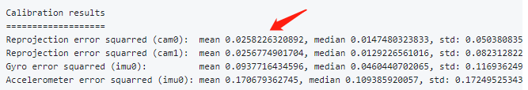
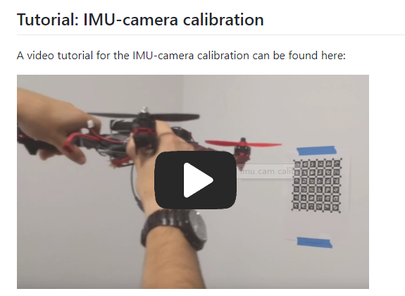
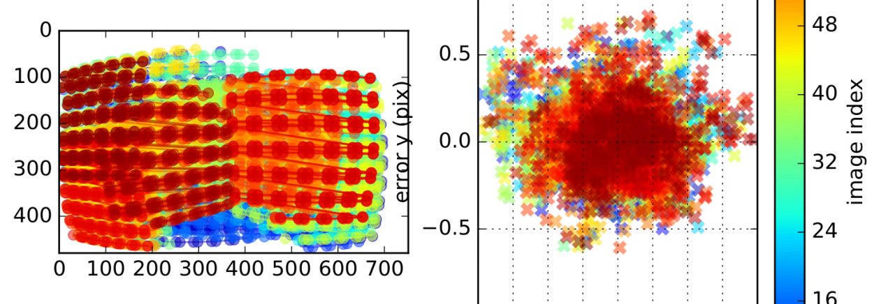
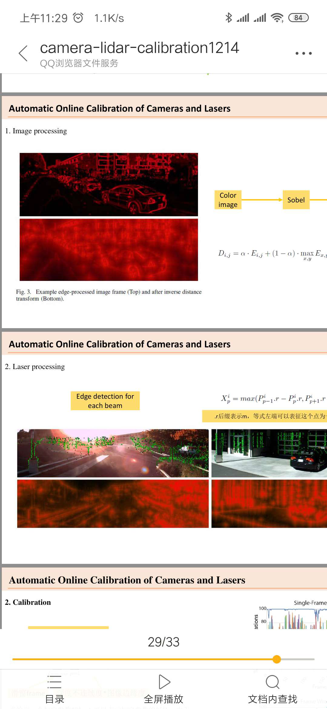

# 第三次讨论会主题：VIO标定总结

## 一、VIO标定的目的

### 1. VIO标定的目的是什么？矫正误差和同步？

**讨论内容：**

1. 不止矫正误差吧，比如相机内参是计算的时候必须的数据啊；
2. 多传感器融合很重要的一个问题是解决时空基准的统一，外参和td标定就是在解决这个问题；
3. 另外，对单个传感器的标定，主要是为了能够得到确定性误差的定量描述，和不确定性测量误差的统计特性，便于在算法中做处理；
4. 多传感器的时空统一简单点说是，时间统一就是同步，空间统一是坐标系关系是吧；
5. 我觉得既然叫标定肯定是系统里面的单个传感器内参和传感器相对关系都得标吧；
6. 各个相机与IMU的内参 各个传感器之间的外参；
7. 还有各种传感器时间坐标系标定，就是所谓的时间偏置；
8. 以相机为例。左右目设计要求baseline 12cm，实际有安装误差。 然后，镜头的sensor也有安装误差。这些误差需要确定。 而每台相机，和每台相机安装误差不一样。  有一类标定，就是标这个的。 标定空间关系；
9. imu的标定和建模有关系，低成本的话，一般包括bias统计特性，非正交误差，标度因数，白噪声统计特性；
10. 然后，各传感器之间数据传输也有时间误差。 这是标时间关系；
11. 标定就是传感器之间的空间误差和时间误差以及传感器本身的特性；
12. 还有些imu三轴角速度计由三个单轴角速度计拼成，有把这三个外参独立标定的；
13. 多个单轴角速度标定；
14. 传感器本身的误差；

**相关文章**：
**Monocular Visual Inertial Odometry on a Mobile Device**

## 二、VIO标定现有方案对比

### 2.VIO标定现有方案有哪些？不论好坏请先罗列出来，开源的请给出地址，未开源请给出文章
**讨论内容：**

1. Kalibr，开源；
2. Vins；
3. Msckf；
4. 纯VIO的应该就这一个吧  但是我现在一般用camdocal标相机内参 然后用kalibr的外参；
5. imu_tk；
   
**相关文章**：
**A robust and easy to implement method for IMU calibration without external equipments**

### 3.目前哪些标定方案比较常用，他们之间的区别是什么？各自的优缺点是什么？
**讨论内容：**
1. 首先说一下我的体验 我一开始确实标不好 当然手法还有标定板都有很大关系；
2. 就大家用kalibr的时候注意打个好点的标定板,还有提前把IMU的参数标定好;
3. 我之所以不用这个功能（自标定），主要是目的是评估odometry结果，如果用他们标定还是要激励充分;
4. 用专门的标定工具，精度理论上是要更高的，毕竟有一个标定板作为强约束;
5. 而且kalibr对imu建模更好, 建模细致;
6. 标定工具和设备的好坏都会影响标定的效果；
7. 我给大家一个参考 就是人家标定出来的误差是什么样子，kalibr:

**参考论文**：

**A Benchmark Comparison of Monocular Visual-Inertial Odometry Algorithms for Flying Robots**

**2014-ICRA High-fidelity sensor modeling and selfcalibration in vision-aided inertial Navigation**

### 4.标定VIO需要哪些额外的工具？分方法举例说明

**讨论内容：**
1. 自标定就激励充分；
2. 选个环境纹理相对丰富的地方就ok吧；其实我刚刚发的哪个截图里边的视频里边有；
3. 如果是kalibr xyz rpy6个自由度都最好激活；
4. 转台 是个工具；
5. 低精度imu转台完全没必要；
6. kalibr 打印一个好的标定版 保证标定版在一个平面上 ；
7. 标定的时候让标定板遍历到整个相机视野；
8. 遍历重叠的结果：

**参考文献**：
**Extending kalibr: Calibrating the Extrinsics of Multiple IMUs and of Individual Axes**

### 5.单目vio和双目vio哪个标定效果更好？两种标定方案的差别是什么？

**讨论内容：**
1. 双目VIO标定存在的问题是视野有限，无法全部覆盖，只能标定重叠部分，单目是可以利用视野里的所有内容；
2. 单目VIO的标定，实际上用了全图视野的内容；双目VIO因为只利用了视野重叠部分的内容，所以会有所偏差；
3. 也就是双目理论上确实标定比单目还是麻烦一点；
4. 标定工具不会管这些，他就用能用的信息，所以也没什么麻烦不麻烦的；
5. 传感器更多标定会更差一点；
6. 双目的话，两个相机都可以对imu的轨迹进行约束，这是双目的一个优势；构造误差项；

**尝试**：
1. 双目，能不能构造两个VIO,一个双目？组合一下？
相当于两两组合标，标完搞个bundle，但是误差感觉还是会比单目差，因为两两标定也就是标单目；
2. 两两标定，再标个方差，融合怎么样；

## 三、VIO标定的分析工具：

### 6.有哪些实用的Allan方差分析工具？

**讨论内容：**
1. 分析工具：matlab :psins工具箱中的avar函数；
2. 一个开源项目：https://github.com/ethz-asl/kalibr/wiki/IMU-Noise-Model；
3. 高文良：imu_utils，开源：https://github.com/gaowenliang/imu_utils；
4. kalibr_allan：https://github.com/rpng/kalibr_allan；
5. 如果编译不过去可以看一下我（晨博）提了一个merge，pull request里面，抱歉我的那个request是在他的依6. 赖库code utils里面，只是个很简单的头文件路径问题；
7. 严恭敏老师的书：

### 7.有的说 用Allan 方差的结果，再乘以10。 这个10倍，也是个经验值。反以，感觉噪声项的标，有主观经验因素在里面；还是直接相信 allan方差的结果？

**讨论内容：**
1. 我是相信它的数量级，然后调系数；
2. Allan方差乘以10其实也是完全由Allan方差决定这个值的吧；
3. 比如标出来3e-5，我实际可能用7e-5；
4. 我自己的算法在EUROC上和用小觅，都是用的同一套参数；	

## 四、VIO标定的实际应用

### 8.有哪些开源项目是关于单目+imu做slam的？

**讨论内容：**
1. 知乎：https://www.zhihu.com/question/53571648；
2. vins、okvis、rovio、r-vio、msckf_mono；
3. TUM的VIO：https://vision.in.tum.de/research/vslam/basalt；

**参考文章**：
**Basalt: Visual-Inertial Mapping with Non-Linear Factor Recovery；**

### 9.如何评估和每次开机自检外参好不好？
**讨论内容：**
1. 这个在相机和雷达标定论文有：

2. 而且其实VINS如果你只设置一个初值的话，也算是每次都标定一下吧；
3. 主要讲雷达和相机虽然在车体固连 但是车跑起来的震动等等因素其实对外参是有影响到；

4. 改进方向：开机自检和评估外参无法做到，只能每次都检查，是个改进的点；

### 10.怎么知道VIO，它已经飘了？还是在正常工作？

**讨论内容：**
1. 这个目前有工程经验方案，理论的没看到有研究的，可能可以归到故障检测里面，是一个研究点；
2. 其实要是系统崩了 是可以有方法能检测到的，挺多算法都有system failure detection 但是如果说崩的因素归结到外参？？？
嗯，我也觉得不会是外参导致崩；
3. 不知道如果把它归结到内参，从数学模型上不太好弄；
4. vins是有failure dection吧；
5. 可能要从固定传感器的工具上解决了；
6. 这个就像琛哥说的 可以从硬件固定入手；
7. imu 或者 camera 被撞歪了？硬件 或者外部的原因 ，imu 和 camera 不同步了？
例如 转角的情况 imu 经常容易跑飞 ；
8. 位置变化的话是不是从模具上搞比较容易一点？如果是无人车这种的是否通过判断角度和之前差距太大？
9. 首先是知道自己偏了 ；
10. 然后怎么纠正过来 系统能容忍多大的误差 ；
11. 怎么保证系统在各种情况下的稳定运行；
12. 像无人车和平面机器人，本来应该只有yaw的，如果算出来其他方向的旋转也比较大，是不是就可以代表出问题了；
13. 我不知道现在的SLAM领域 是否引入一些 控制系统里面的容错的adaptive 的方法；