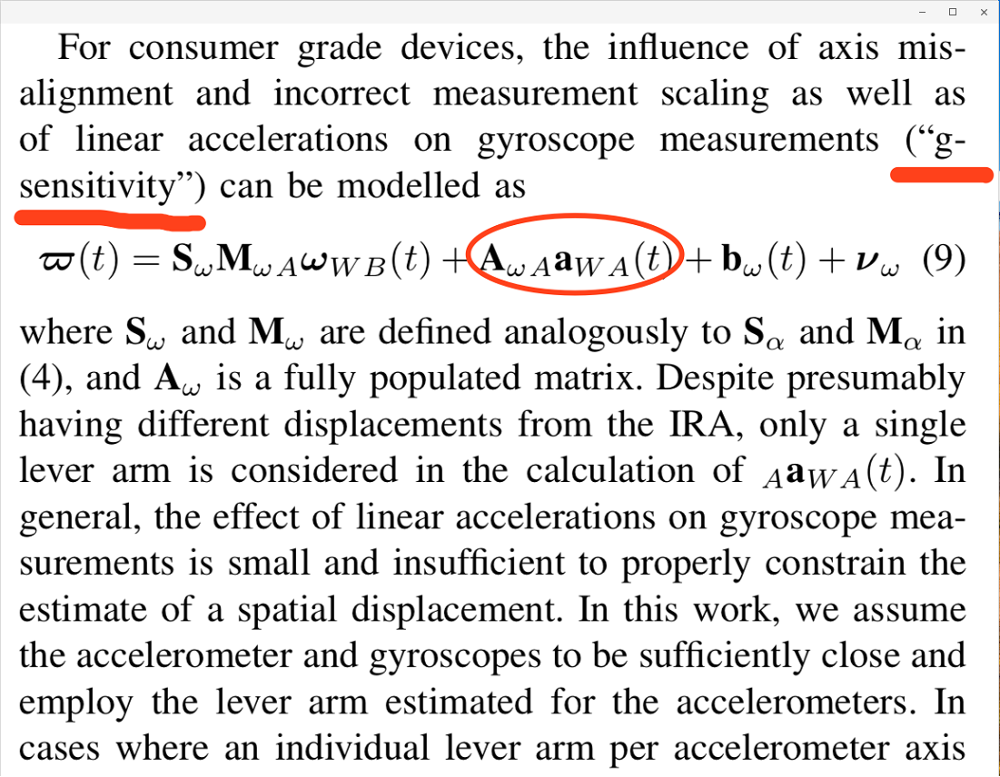
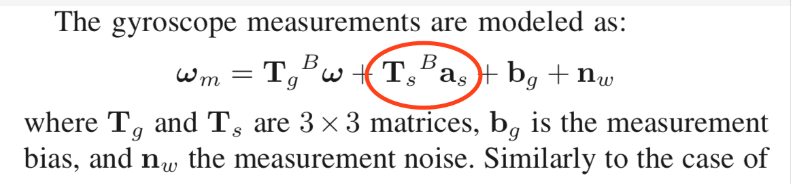
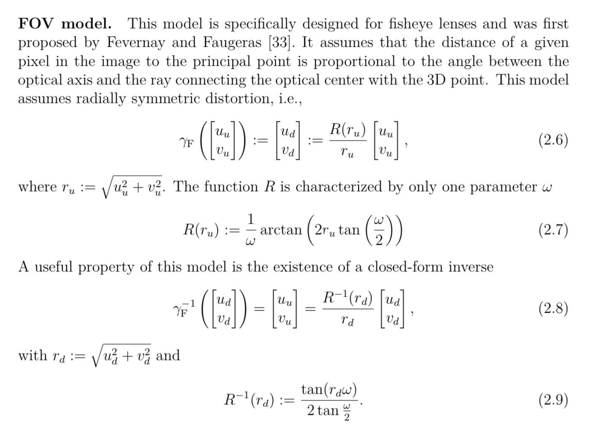
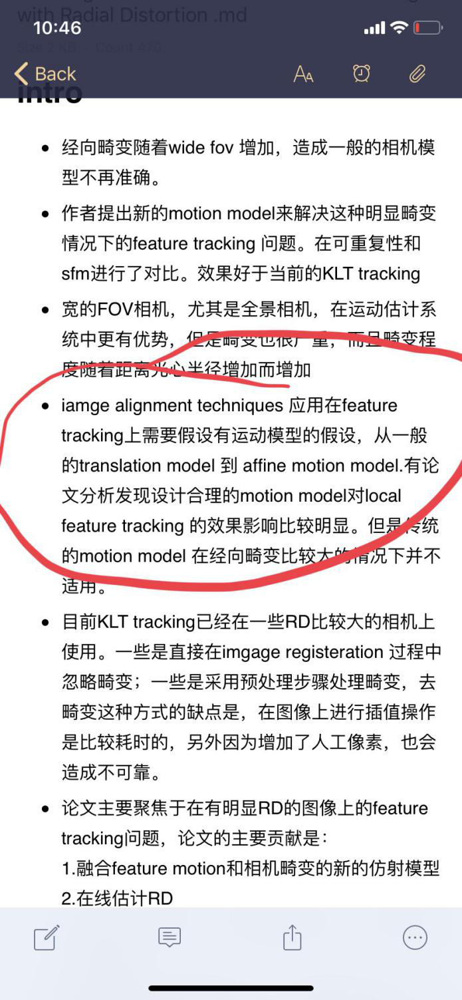

#第四次讨论主题：传感器模型 + VIO分类

##传感器模型
###1、几种IMU的数学模型

1. 最简单的就是“测量值=真值+bias+noise”模式，这个模式下面bias一般建模成random walk，然后还有bias建模成markov process的。在vio里不多见，gps/ins里比较常用
2. 测量值=真值+bias+noise 这个模式忽略了3轴加速度计和陀螺仪的非正交误差 标度因数误差
3. imu标定中有一个非常有名的方法叫多位置法 就是用来标定非正交和标度因数，非正交指的是实际的三轴并非完全正交，标度因数指测量值和实际值存在一个固定的比例关系，标度因数英文也是scale 不要和视觉里面的scale混淆
4. 非正交误差和标度因素都需要乘个矩阵吧？
   是的
5. 多位置法是将IMU六个面轮着朝下一遍吗？
   这个有各种 我以前做的时候好像是24个位置 ，不光有朝下的 ，还有斜着的
6. 低精度的陀螺仪还有一个误差源叫 g-sensitivity，这个误差源一般针对mems器件（低精度mems），mems也有高精度的 一般高精度的器件不会考虑这个g-sen，高精度器件一般会离线标定好非正交和标度因数，不会在线估计这些东西
7. 是不是误差模型越复杂，效果越好？   
   不一定，估计的参数多了 滤波器不见得会更稳定

**相关文章**

Extending kalibr: Calibrating the Extrinsics of Multiple IMUs and of Individual Axes
 
  

High-fidelity Sensor Modeling and Self-Calibration in Vision-aided Inertial Navigation 李明阳
###2、Mems指的是什么
https://baike.baidu.com/item/%E5%BE%AE%E6%9C%BA%E7%94%B5%E7%B3%BB%E7%BB%9F/1718090?fromtitle=MEMS&fromid=686299&fr=aladdin

###3、事件相机在SLAM中的数学模型
1. 没玩过事件相机，只是从资料看，推测它就是 vo
2. event我记得说是对于光暗变化剧烈的时候效果也不错
3. 事件相机，就是帧率高， 低光照下也有特征点。 没有imu也能跟踪的好。  就是传感器好，而且还省电

###4、鱼眼相机的高畸变在SLAM中是如何处理的？是畸变矫正还是特别的相机模型
1. 鱼眼用立方体投影模型比较好
2. 或者投影到一个平面，我觉得更好的思路还是用六面体把鱼眼拆成更多透视，而不是一个平面
3. 我觉得可以去看camodocal 就vins提供的那个，有很多相机模型

**相关文章**
Large-Scale Direct SLAM and 3D Reconstruction in Real-Time ， PhD Thesis  Jakob-Julian Engel
A Generic Camera Model and Calibration Method for Conventional, Wide-Angle, and Fish-Eye Lenses

###5、畸变对feature tracking的影响
1. 有些论文提到做畸变矫正再tracking一个是增加计算负担，另外一个是矫正中使用差值方法引入人工像素，会对结果有影响，有的做法是修改klt（kanada lucas tracking）的运动模型，之前假设是线性运动的，有的会使用考虑畸变的运动模型

2. klt跟踪的时候 有运动模型的嘛？不是直接迭代吗？

3. 还有这些运动模型的增加会不会引入额外计算量呢？会增加一些，大概15%这个论文提到，但是畸变大的情况下，效提升果比较明早。畸变小的情况没必要，所以要结合使用相机和参数设计motion model
4. 这里是物方还是像方的运动模型？就是是相机的运动还是像素的运动啊？
   应该是像素的，感觉是像方
5. 是指光流局部匹配时的模型吧？这个是说patch的模型？
   嗯，感觉是，我大概理解是之前是假设像素的patch是平的，现在不这么假设了，想当于对这个小patch做畸变矫正。畸变导致小patch形变 需要设计模型来矫正这个东西 再来算intensity error

###6、卷帘相机的影响
1. 卷帘相机是不是可以理解，自身图像像素都不是同步的？
   是哒，卷帘门就是一行行或者一列列曝光的
2. 不能用于高速运动，自动驾驶好像都不用卷帘，主要是手机上
3. 那用卷帘相机有啥好处吗？
   便宜，现在全局快门也不贵

###7、双目相机的数学模型 
1. 不就是三角测量算深度么。 然后，双目的图像时间要同步。
2. 标定，纠正 使极线对齐
3. 自标定 也要搞，主要是解决外参的微小形变。
4. 之前有看到一个说法，对极几何层面的双目标定，有优化极限，只能在对极几何误差上做到最优，但是这个结果不是最好的，所以有引入三视图做refine
5. 标定不好，匹配就不会好，深度图就不会好
极线对齐， 就是 双目 不可能完全平行。 通过标定，拿到偏移量(平移，旋转)，然后 纠正图像。 让图像变成平行的。
6. 其实我有一个问题 如果说是鱼眼或者广角的双目 是不是有另外一个什么约束 极线约束是针对透视投影的是吧
7. 我一直觉得把双目简化成一维 会不会增强了系统误差？
   有可能。不改极线，就做出深度图。太先进了，第一次听说。现在流程都是  标定，纠正，匹配，出视差图，出深度图
8. 包括s-msckf以及vins-fusion似乎都不校正？
对 ，我就想说smsckf就是只用来初始化点 外参也不管直接当测量用
9. 其实我觉得多了一个同类型的约束 不见得多了就会精度有提升 」双目不仅是同类型约束吧 还有一个基线长度的新信息
10. 那倒是的 那我想想这个话应该怎么说，不过从重建的角度来讲 可能是你说的那个意思

###8、双目相机应用中的关键问题
1. 标定
2. 同步也挺麻烦的
3. 在线标定 是个关键问题，主要解决长时间使用后，双目形变的问题。
4. 是不是缺乏一个精准的评判指标也可以认为是解决这个问题的困扰？是啊 我觉得这种东西很多时候只能从最终的定位或者重建结果来看是不是有效果，或者有一个比较好的仿真环境 可以开上帝视角
5. 小觅双目，板子后面在加强板。 所以，双目外参的形变不会太大。 如果，只是pcb板连接双目。 双目长时间后，位移严重，影响效果。  在线标定，解决的是外参的变化的问题。
6. 双目应用中的问题，如果用在建图上，就是 视角没有雷达广。 雷达是360度。 双目取决于FOV。 肯定没有360度。
7. 我遇到的比较多的问题是， 双目跑vins飘——分析一下，还是用户对vio不了解。 拿到相机，大部分对着白墙。 或者，跑的时候翻腕。
8. 翻腕会导致双目飘？
   对，vins会这样，msckf没试过
9.  双目出深度图 都是用点吗，可以用线面做吗？
    有基于面匹配算深度的（面匹配， 算力要大一些。 还有，深度不连续的时候，有时候容易估计错，噪声比较多），目前deep learning做深度，效果也不错

##VIO分类

###1、在松耦合和紧耦合两类VIO中，有哪些相关工作
1. 紧耦合： vins，viorb，dsvio，svo2.0，msckf，iceba
2. 松耦合：松耦合利用信息不充分 已经没什么人研究了，soft slam里面有个松耦合的东西，用imu结果直接当旋转

###2、VIO的分类除了紧耦合、松耦合，还有哪些类别
1. 直接法、间接法 
2. 稀疏、 稠密