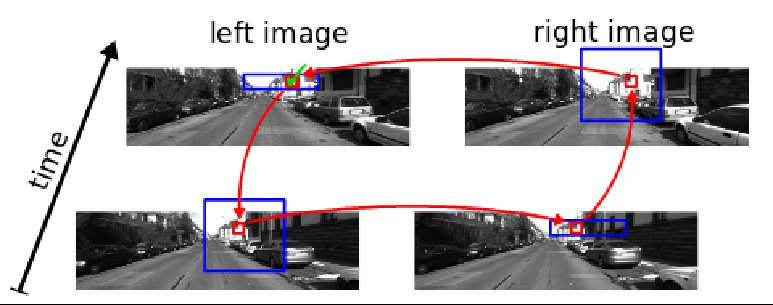
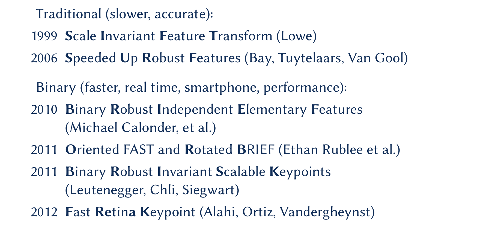
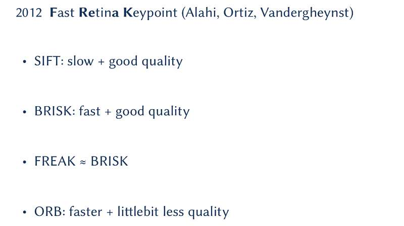

# 主题：前端
前端所涉及的内容广泛，本次讨论主要关注特征点相关部分，其他内容在后续讨论中会进行补充。

### 1. 对于外点的处理目前有哪些方法，分哪几类？
在经典的slam框架中，前端对于特征点的处理，按照点对是否有对应关系可以粗略地分为两种，即有**对应关系**和**无对应关系**。

1.1 首先，对于**具有对应关系**的特征点来说，尽管对应关系存在，但对应关系的正确与否是未知的，外点即指那些具有错误对应关系的对应点，它们的存在会严重影响求解，因而有必要将外点剔除(outlier remove)，或选用对外点鲁棒的估计算法(robust estimation)。
* RANSAC类方法以及其变形。RANSAC是一种“假设检验”的思想，该简单却有力的经典思想于1981年提出，影响深远，后续的工作中有许多对传统RANSAC的变形。例如，在VIO里结合IMU以及运动模型，有2-ptRANSAC，1-ptRANSAC。
* Hough变换。Hough变换的核心思想为“投票”，其实与RANSAC在某种意味上如出一辙。Hough目标是选取最高的投票数，RANSAC目标是选取最大一致集（允许精度范围内内点个数最大），同时，经典的Hough变换提出之后，也确实有Randomized Hough变换延伸出来，其改进的地方即为投票的方式。这里还有一篇2013年CVPR文章可以借鉴，[Robust Feature Matching with Alternate Hough and Inverted Hough Transforms](https://www.cv-foundation.org/openaccess/content_cvpr_2013/papers/Chen_Robust_Feature_Matching_2013_CVPR_paper.pdf)，它的核心思路是内点的pose参数会聚合在一起，外点算出的pose则各不相同。 
* M-estimation，这里的"M"意味着最大似然估计，常用IRLS（迭代权重最小二乘法）来优化loss function。
* 全局类方法，其可以保证得到的解是全局最优解，而常见的RANSAC类方法不仅解是局部解，它的解还是随机的，不确定的。但往往由于全局类算法运行效率低，实用层面上还有一段距离。
* 确定性方法，这类方法不能保证得到的解是全局最优解，但可以保证无论运行多少次结果是唯一的，即消除了解的随机性。

前端完成对outliers的处理之后，仍不能保证剩下的都是inliers，可能有outliers进入后端。
* ekf方案中，在后端有一个基于卡方分布的gating test 也可以一定程度上剔除outliers。
* BA迭代过程中利用鲁棒核函数也可以剔除outliers。
* 测绘里还在BA的时候给残差加权重来剔除外点，这和核函数有点类似。
* 在circle match中，可以剔除outliers，下图是双目的示意图，若对单目来说，比较的就是前后两帧了。

1.2 关于**无对应关系**特征点，在激光SLAM中较常见，如无对应关系的pose求解问题。虽说在算法的使用过程中，不需要点对的对应关系，但在算法的求解过程中，寻找对应关系和求解pose是chicken-egg问题，只有找到对应关系才能相对准确求解pose，只有已知pose才能给出对应关系，如何找寻突破口迭代优化是这类算法的核心问题，因此这类算法本身也要涵盖对outliers一定程度上的处理能力。

### 2. 特征点提取方法中，关于识别性能和提取速度上，有没有能跟orb接近的，或者比他好的？利用深度学习来做特征点匹配，有没有比较成功的应用到SLAM系统中的？

这部分关于特征点提取的讨论内容，我们分为**传统方法**和基于**深度学习方法**。
2.1 **传统的特征点提取方法**，由下图概括给出。在现有的开源的SLAM算法中，描述子提取特征点的方法还是orb，光流的方法还会由Harris 和Fast。这里提供一个比orb效率更高的特征点提取方法，[BFROST: Binary Features from Robust Orientation Segment Tests accelerated on the GPU](http://www.prasa.org/proceedings/2011/prasa2011-05.pdf)，本算法代码开源，比orb速度快约10倍左右，不过更适合并行化。

    

2.2 **基于深度学习方法**，如开源的[GCNv2_SLAM](https://github.com/jiexiong2016/GCNv2_SLAM)，是用深度学习提取特征描述子，替代orbslam中的orb描述子，网络训练好之后的使用阶段，特征点的提取可以做到实时，但是关于该开源方案的泛化能力还未尝试过。我们希望基于深度学习的方法能突破一些目前传统特征的瓶颈，比如白天夜晚光照变化大等恶劣情况。

### 3. 特征点在影像上的分布到底对VO的精度产生多大影响？有没有量化指标？
关于这点的讨论，转知乎上一讨论[ORB特征提取策略对ORB-SLAM2性能的影响](https://zhuanlan.zhihu.com/p/57235987)，作者在提取ORB特征时，尝试了OpenCV的实现和ORB-SLAM2的实现，特征点分布特点分别为“扎堆”和“均匀”，然后探讨特征点的分布对ORB-SLAM2的影响，结论简要概括为均匀化特征提取策略确实可以提高系统的精度和鲁棒性。

除此之外，为了提供系统的鲁棒性和精度，可以采用把translation和rotation分开解的策略，远处定rotation，近处定translation，例如ekf-slam。这种策略符合常理，比如人都是看远处来定方向的，可想而知远处的rotation即使有误差，也比近处的小，同时近处的特征点具有平移大的特点，分辨率也会更高。但为了区分远近，还是要先有一个depth map才行。

### 4. 深度学习网络来解pose是怎么编码到网络里的？
这里提供一篇CVPR2019单目深度估计的文章，[Digging Into Self-Supervised Monocular Depth Estimation](www.github.com/nianticlabs/monodepth2) ，一般求解pose，假设一个6个参数的矩阵，然后拟合出六个参数，即是用网络来拟合函数。
