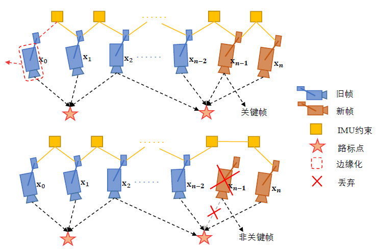
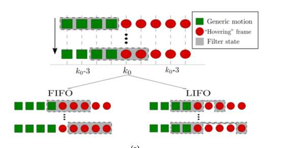

# 主题：VIO中的滑窗设计

本次讨论主要包含前端相关的两个问题和关于后端滑动窗口的四个问题。

## 前端
###  1. 基于描述子的光流意义大不大
光流追踪角点或特征点的时候加上周围一圈像素，像是ORB那样，保留周围的像素和被追踪像素的明亮关系，这样追踪的时候是否更鲁棒？注意并非光流跟踪整个patch，除了被追踪点，周围的信息保留的都是1和0的亮暗关系。

该方法具体可以参考以下论文：
> H. Alismail, M. Kaess, B. Browning and S. Lucey, "Direct Visual Odometry in Low Light Using Binary Descriptors," in *IEEE Robotics and Automation Letters*, vol. 2, no. 2, pp. 444-451, April 2017.

可以第一帧提取描述子，光流跟踪的就是描述子，有时候也会使用特征点检测的点作为光流跟踪的初始点。但要注意而且光流跟的一些点可能根本不适合用于做描述子。
用描述子初始化可以理解，但是如果光流角点+描述子，则就不一定好，因为特征点精度优于角点精度。

###  2. 直接法和特征法谁更具有优势？或者是两者可以互补？
直接法利用的信息更多，似乎更有潜力做的比间接法更好。但直接法对光照和旋转不太好，特征点的描述子对这两种情形有鲁棒性。注意到，弱纹理下肯定直接法比较好。

直接法少了提取特征的过程，可以提高帧率。关键是快速运动的时候，如何平衡直接法和间接法的帧率，从而解决快速运动模糊的问题。

直接法和间接法结合的工作可以参考以下论文：

> S. H. Lee and J. Civera, “Loosely-coupled semi-direct monocular slam,” IEEE Robotics and Automation Letters, vol. 4, no. 2, pp. 399–406, April 2019.
> S. Li, T. Zhang, X. Gao, D. Wang, and Y. Xian, “Semi-direct monocular visual and visual-inertial SLAM with loop closure detection,” Robotics and Autonomous Systems, vol. 112, pp. 201 – 210, 2019.
> X. Gao, R. Wang, N. Demmel, and D. Cremers, “LDSO: Direct sparse odometry with loop closure,” in IEEE/RSJ Intl. Conf. on Intelligent Robots and Systems (IROS), 2018.

## 后端
后端所涉及的内容广泛，本次讨论主要关注滑窗相关部分，其他内容在后续讨论中会进行补充。

###  1. 为什么要引入滑窗？引入滑窗的优劣？滑窗marg出先验项作为先验信息的作用大不大？
引入滑窗的目的主要在于：**减小状态维数，减小计算量**。滑窗算是精度与速度的一个平衡，如果不使用滑窗的话优化时就要求解历史的所有信息。

使用滑窗是为了**减少优化时间，损失了一点精确性**。

比如DSO里面使用滑窗，是因为我们在使用的时候做优化时，随着时间的进行，会导致优化的问题越来越大。因此，DSO会维护一个大概七帧的Hessian阵以及两千个点的Hessian阵。边缘化的时候，会把不要的点和帧从海塞阵中去除，得到一个先验信息，把这部分先验存储到另外的帧或者点中。DSO这种用法给人感觉就是ORB-SLAM里面的局部优化，也就是local ba，一次只要局部共视图里的帧进行优化。

注意到DSO是用marg弄出了先验项，ORB则是在滑窗里固定一些节点来保持一致性，以此来作为先验信息。如果没有滑窗marg出的先验项的话，优化问题的解会在零空间上乱跑。

###  2. 滑窗这种算法思想都在哪些领域有应用，有哪些变种？
几项使用滑窗思想的经典工作比如：VINS， VI-ORB，MSCKF， MSCKF-VIO等。

滑窗的变种有**时间滑，共视滑，空间距离**等。各自的代表方法就是DSO和ORB。

DSO不希望窗口里的帧离得太近，DSO的共视滑是每一帧的内点至少是5%，当然这个要求是比较容易满足的。
所以它就再设置了一个空间距离上的，任意一个帧跟其他帧的空间距离合最近的剔除。所以根本上，它就是不想帧间太近，而是可以在空间均匀分布。

以下是两幅滑窗的示意图：

而在下文工作中，主要思路在处理无人机悬停时候，根据如果是hovering状态，window是LIFO的 ；如果是正常状态window 是FIFO。判断是不是hover的标准是视差。

> D. G. Kottas, K. Wu, and S. I. Roumeliotis, “Detecting and dealing with hovering maneuvers in vision-aided inertial navigation systems,” in 2013 IEEE/RSJ International Conference on Intelligent Robots and Systems, Nov 2013, pp. 3172–3179.

###  3. 滑窗的参数设置（如窗口大小）有什么原则和规律？
原则是保证window里一定有足够视差的pose。具体可参考：VINS， MSCKF-VIO。

###  4.  一般来说，滑窗大一点先验信息会好一些，但是速度会慢。有精度要求不能简单减少滑窗规模的情况下，如何优化？

首先明确的是未必滑窗大一些先验信息会好。先验信息倒确实会通过共视共约束关系来传递的，但是如果先验就是对差不多数量的节点有直接约束，那后面滑窗规模多大也不一定有很大作用。

第二个小问题很细节，要根据实际情况来调。