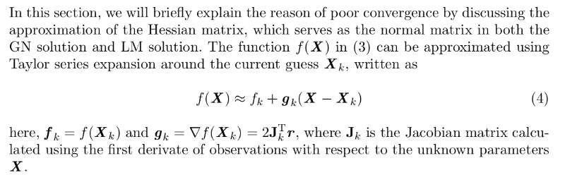
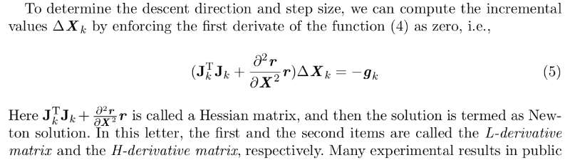
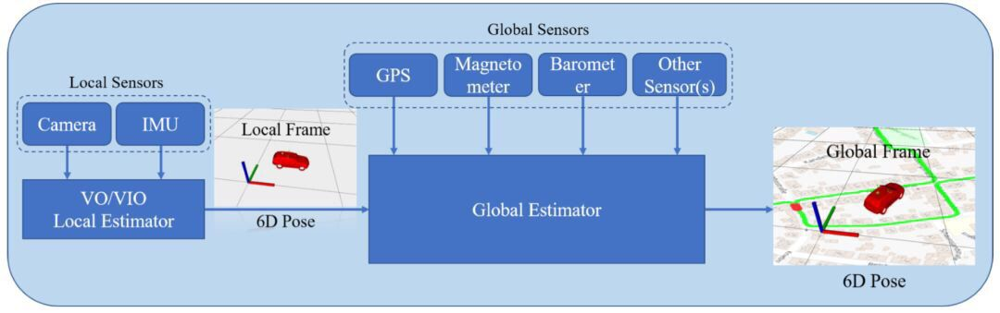

## 主题：VIO中后端优化相关问题

### 1.SLAM中常用的优化方法有哪些？

1.1 [Gauss-Newton](https://blog.csdn.net/eric_e/article/details/80372679)；[LM](https://blog.csdn.net/eric_e/article/details/80372679)；[Dog-leg](https://blog.csdn.net/eric_e/article/details/80372679)；[Conjugate Gradient(CG,共轭梯度法)与Preconditional Conjugate Gradiem method(PCG,预优共轭梯度法)](https://blog.genkun.me/post/cg-pcg-implementation/)

1.2 GN,LM,Dog-leg三种优化方法的分析与对比见[链接1](https://optsolution.github.io/archives/58892.html) [链接2](https://blog.csdn.net/eric_e/article/details/80372679). CG与PCG方法的原理与实现见[链接](https://blog.genkun.me/post/cg-pcg-implementation/).

1.3 开源VIO算法中VINS用到了Dog-leg. 项目[EIBA](https://arxiv.org/pdf/1711.05166.pdf)确认用了PCG，[ICE-BA](https://github.com/baidu/ICE-BA)也用了.

### 2.一阶与二阶优化方法的区别？

2.1 一阶与二阶的定义：

从 cost function开始说，构建error function 之后，就有了cost function. 我们对cost function进行泰勒展开

其中泰勒展开的阶次则对应着一阶和二阶。

2.2 一阶是最速下降方法，有可能收敛慢，不一定准；二阶比较准，不容易奇异Hessien,较慢。GN方法是近似的二阶。

一阶，二阶，GN，LM方法的分析与速度对比见[链接](https://blog.csdn.net/orange_littlegirl/article/details/88627692).

2.3 优化问题几大要素

* costfunction的构建。
* 初值的选取（一般代数法结果作为初值，然后数值迭代）
* 迭代方向的确定
* 步长的确定（牛顿法是木有的，GN的步长默认为1）

2.4 深度学习优化方法总结见[链接](https://blog.csdn.net/u012759136/article/details/52302426).

### 3.什么时候使用线搜索或者置信域方法？

3.1 [线搜索](https://blog.csdn.net/tsroad/article/details/50249393)与[置信域]([https://www.codelast.com/%E5%8E%9F%E5%88%9B%E4%BF%A1%E8%B5%96%E5%9F%9Ftrust-region%E7%AE%97%E6%B3%95%E6%98%AF%E6%80%8E%E4%B9%88%E4%B8%80%E5%9B%9E%E4%BA%8B/](https://www.codelast.com/原创信赖域trust-region算法是怎么一回事/))的解释与说明。

3.2 讨论结论来看，大家一般都可能用直接现成的库，其实内部核心只是配置相关参数而已。

### 4.深度学习用于SLAM优化求解器的前景怎么样？

​		虽然也有很多Demo在做，譬如无监督的端到端的[unDeepVO](https://arxiv.org/pdf/1709.06841v1.pdf).但是泛化能力一直是一个很难解决的问题，现在得到的反馈都是在数据集上确实能有很好的效果，但将模型运用到自己数据集上并不能得到很好的效果。而且端到端的问题是说有可能是一个黑盒，没有很好的办法去debug。

### 5.多传感器融合的约束对于后端优化的帮助有多大？（比如vins现在开源的接口添加了各种全局位姿传感器的目的是消除vo的累积误差）

5.1 BA (Bundle Adjustment）又叫捆集调整，摄影测量学又叫光束法平差，测绘学又叫空三（空中三角测量）。

5.2 多传感器譬如IMU的引入能够减小累计误差，而且IMU与Vision是相辅相成的。[Vins-fusion](https://mp.weixin.qq.com/s?__biz=MzI5MTM1MTQwMw==&mid=2247504550&idx=1&sn=28311396bf1b3469297aa13b3a3b2828&chksm=ec136ca2db64e5b4bf91bba0736ce7d4c9438db0889108f35b669fc380e6cc939cddc299a1bd&mpshare=1&scene=1&srcid=04187loHMKTOpahKJb8nnBOG#rd)中IMU与视觉是紧耦合的，vio与GPS等等是松耦合的。

5.3 GPS以及回环都是可以减小全局误差的，另外讨论中提到了回环问题，其实也算是Pose Graph问题，它形象上讲是将误差匀一匀，但不一定是均分，使得整体误差最小，因为每个节点对总体误差的贡献程度不一样。 

